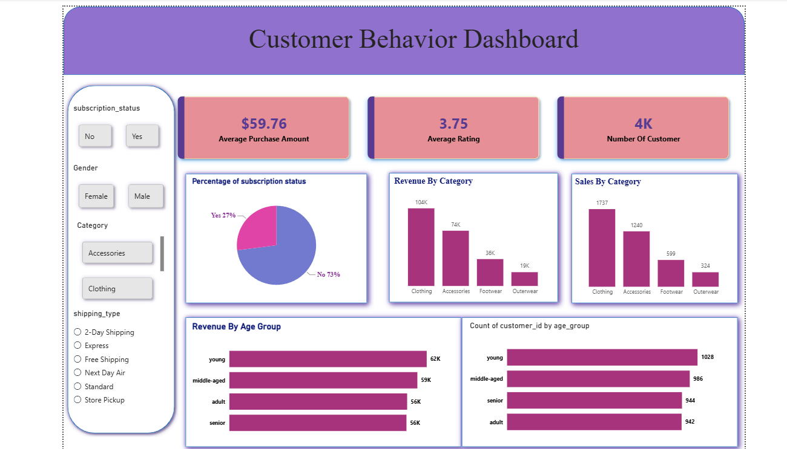

# 🛍️ Customer Shopping Behaviour Analysis

An end-to-end data analytics project analyzing customer shopping behavior using **Python, SQL Server, and Power BI**.

The project covers the complete analytics workflow, from raw data cleaning and transformation to SQL-based business analysis and Power BI visualization.

---

# 🐍 Python Data Preparation

The raw customer shopping dataset was loaded and prepared using **Python and Pandas**.

### Data Exploration

- Loaded the CSV dataset using Pandas.
- Inspected the dataset structure and data types.
- Generated descriptive statistics.
- Checked for missing values.
- Analyzed review rating distributions.

### Data Cleaning & Transformation

- Handled missing **Review Rating** values using the median rating within each product category.
- Standardized column names.
- Renamed `purchase_amount_(usd)` to `purchase_amount`.
- Removed the `promo_code_used` column as it was not required for the analysis.
- Created customer age groups using `pd.qcut()`.
- Converted purchase-frequency categories into numerical day intervals.

### SQL Server Integration

The cleaned dataset was loaded into SQL Server using **SQLAlchemy and PyODBC**.

---

# 🗄️ SQL Analysis

SQL Server was used to answer business-focused questions about customer shopping behavior, including:

1. Revenue generated by male vs. female customers.
2. Customers who used discounts but spent above the average purchase amount.
3. Top-rated products.
4. Average purchase amount by shipping type.
5. Subscription status and customer spending.
6. Products with the highest discount rates.
7. Customer loyalty segmentation.
8. Top products within each category.
9. Repeat buyers and subscription status.
10. Revenue contribution across customer age groups.

---

# 📊 Power BI Dashboard

The SQL analysis was visualized using an interactive **Power BI dashboard** covering customer spending, revenue, products, subscriptions, discounts, and customer segments.

### Dashboard Preview



---

# 💡 Key Business Insights

- Male customers generated **$157,890** in total revenue compared with **$75,191** from female customers.
- Express shipping customers had an average purchase amount of **$60.48**, compared with **$58.46** for Standard shipping.
- Subscribers had an average purchase amount of **$59.49**, compared with **$59.87** for non-subscribers.
- Non-subscribers had an average purchase amount approximately **0.63% higher** than subscribers.
- Non-subscribers generated **$170,436** in total revenue compared with **$62,645** from subscribers, largely because the dataset contains more non-subscribers.
- The **Loyal** customer segment was the largest, with **3,116 customers**.
- **Hat** had the highest discount rate at approximately **50%**.
- The **Young** age group generated the highest revenue at **$62,143**.
- **Gloves** had the highest average product rating at **3.86**.

---

# 🎯 Skills Demonstrated

### Python

- Pandas
- Data cleaning
- Missing-value handling
- Exploratory data analysis
- Data transformation
- Customer segmentation

### SQL

- Aggregations
- GROUP BY
- Subqueries
- CTEs
- CASE statements
- Window functions
- ROW_NUMBER()
- Ranking
- Business analysis

### Power BI

- Dashboard development
- Data visualization
- KPI reporting
- Interactive reporting
- Business storytelling

### Data Integration

- SQLAlchemy
- PyODBC
- Python-to-SQL Server workflow

---

# 📁 Project Structure

```text
Customer_analysis/
│
├── README.md
├── customer_bhevaiour.ipynb
├── SQLQuery1.sql
├── customer_shopping_behavior.csv
├── powerbi_dashboard.png
└── customer_behaviour.pbix
